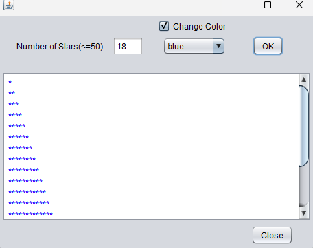

# StarsApp
A simple Java Swing application that prints a triangle of stars based on user input (max 50). You can also change the star color.

## Features
- Input number of stars (1-50)
- Display stars in a triangle
- Optional color selection (Red, Green, Blue, Yellow, Magenta, Black)
- If the user does not select a color, the stars’ color will default to red
- Simple GUI with OK and Close buttons

## How to Run
1. Open `Stars.java` in any Java IDE or terminal.
2. Compile and run:

```bash
javac Stars.java
java Stars
## ScreenShot



